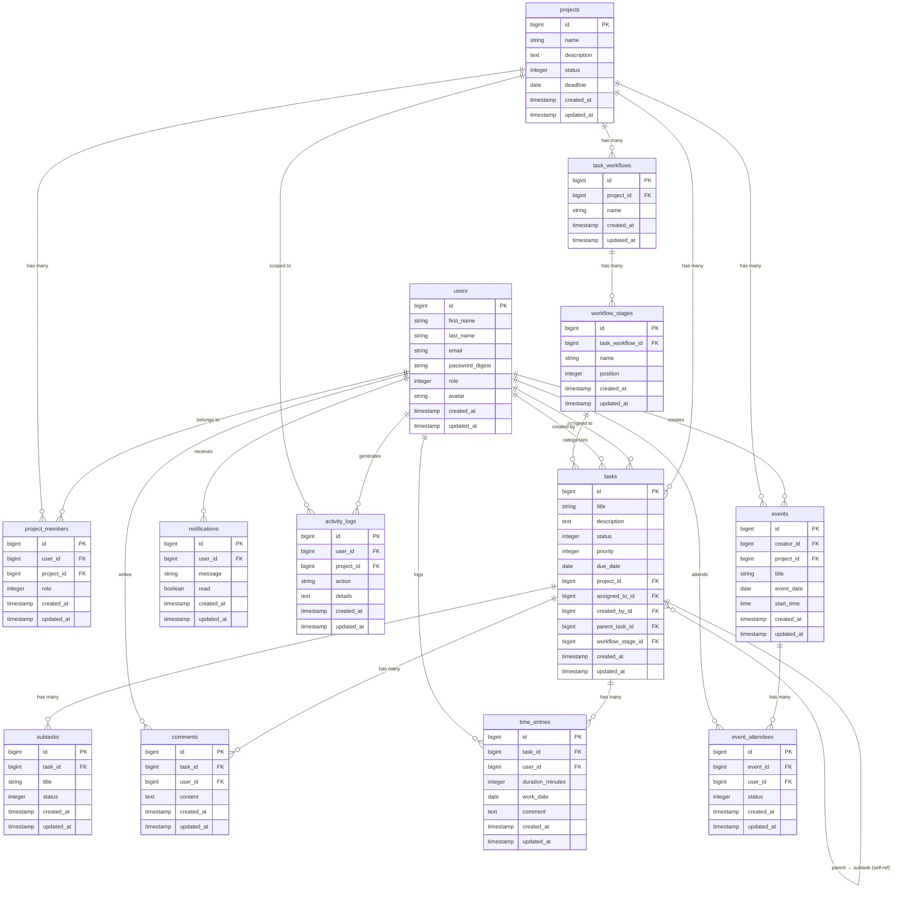

# Database Schema — HyperFlow

13 tables across 5 domains: users, projects, tasks, events, and audit/support tables.

---

## ERD

---

## Enum Values

| Table | Column | Values |
|---|---|---|
| `users` | `role` | `0=admin` `1=member` |
| `projects` | `status` | `0=active` `1=on_hold` `2=completed` `3=archived` |
| `tasks` | `status` | `0=to_do` `1=in_progress` `2=done` `3=cancelled` |
| `tasks` | `priority` | `0=low` `1=medium` `2=high` `3=urgent` |
| `subtasks` | `status` | `0=to_do` `1=done` |
| `event_attendees` | `status` | `0=invited` `1=accepted` `2=declined` |

---

## Key Constraints

- `users.email` — unique index
- `project_members(user_id, project_id)` — unique index (no duplicate memberships)
- `event_attendees(event_id, user_id)` — unique index (no duplicate attendance)
- `tasks.parent_task_id` — self-referential FK (task hierarchy, one level)
- `tasks.assigned_to_id` — nullable (unassigned tasks allowed)
- `activity_logs.project_id` — nullable (some actions are not project-scoped)
- `events.project_id` — nullable (events can be standalone, not tied to a project)
